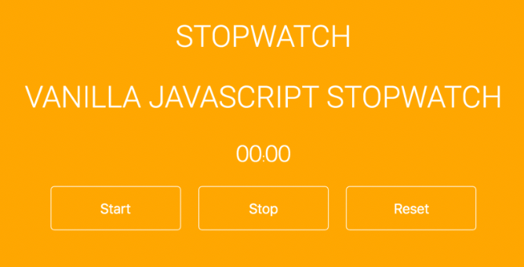

# Stopwatch

The objective of this challenge is to build a stopwatch ([codepen example](https://codepen.io/cathydutton/pen/xxpOOw)):

## Requirements

- Start: it should be a button for start clock running
- Stop: it should stop the counter and show the time elapsed
- Reset: it should restart the time count to 0

should looks like:

